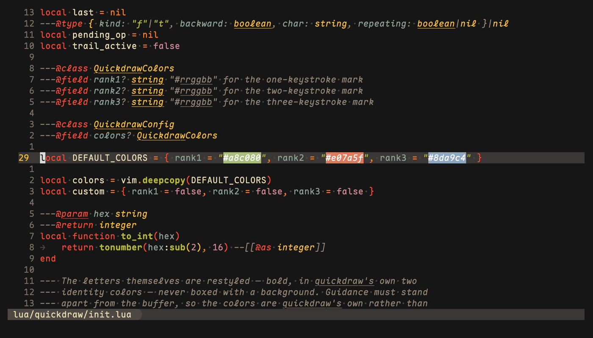

<!-- Header -->
<div align="center">
    <h1>Quickdraw.nvim</h1>
    <p>
        Press f. See how far it reaches.
        <br />
        <a href="#about">About</a>
        ·
        <a href="#installation">Installation</a>
        ·
        <a href="#how-it-works">How it works</a>
        ·
        <a href="#highlights">Highlights</a>
        ·
        <a href="#contributing">Contributing</a>
    </p>
</div>

<!-- Demo -->
<div align="center">
    
</div>

## About

Quickdraw.nvim extends `f`, `t`, `F`, and `T` to reach any visible line and
shows you the cost of every jump before you take it. When you press `f`,
the view dims and each reachable character is colored by how many
keystrokes it takes to land on it:

- First color: `fx` lands here.
- Second color: `2fx` lands here.
- Third color: `3fx` lands here.

You type real characters from the text. There are no hint labels to read
and no new motions to learn. If the character you want is not lit, it is
more than three occurrences away, and a plugin built for long jumps is the
better tool.

Quickdraw's only options are its three colors. It requires Neovim 0.10+.

## Installation

Using [lazy.nvim](https://github.com/folke/lazy.nvim) (recommended):

```lua
{
    "rvaccone/quickdraw.nvim",
    ---@type QuickdrawConfig
    opts = {},
}
```

To change the colors:

```lua
opts = {
    colors = {
        rank1 = "#a8c080", -- matcha
        rank2 = "#e07a5f", -- terracotta
        rank3 = "#8da9c4", -- stoneware blue
    },
}
```

> [!NOTE]
> Quickdraw remaps `f`, `t`, `F`, `T`, `;`, and `,`. Disable plugins that
> highlight the same motions, such as eyeliner.nvim or quick-scope.

## How it works

- `f` and `t` search forward through the visible window, `F` and `T`
  backward. Folded lines are skipped: if you cannot see it, you cannot
  target it.
- Highlights appear the moment you press the key and clear the moment you
  act. Whitespace is jumpable but never painted.
- Counts work natively: the tier colors are exactly the counts you can
  type.
- `;` repeats and `,` reverses. After you land, the nearest occurrences of
  your character stay lit until you press something else, so a repeat is a
  decision you read, not a guess.
- Jumps to another line push the jumplist, so `<C-o>` returns. Jumps on
  the same line stay native and do not.
- Operators work across lines: `dfx`, `cfx`, and `yfx` behave like their
  native versions, and `.` repeats the whole change.

## Highlights

The letters themselves are recolored and bolded; nothing is drawn behind
them. The two rank colors are quickdraw's own, chosen from outside
typical code palettes so targets never blend into syntax highlighting.
Set them in `opts.colors`, or override the groups directly; colors given
in setup win over colorscheme definitions:

| Group            | Default             | Meaning                 |
| ---------------- | ------------------- | ----------------------- |
| `QuickdrawRank1` | `#a8c080` (matcha), bold     | Lands with `fx`         |
| `QuickdrawRank2` | `#e07a5f` (terracotta), bold     | Lands with `2fx`        |
| `QuickdrawRank3` | `#8da9c4` (stoneware blue), bold | Lands with `3fx`        |
| `QuickdrawDim`   | Linked to `Comment` | Everything out of reach |

`:checkhealth quickdraw` reports version, keymaps, and conflicts.

## Contributing

```sh
make test       # run the test suite
make fmt-check  # check formatting with stylua
```
